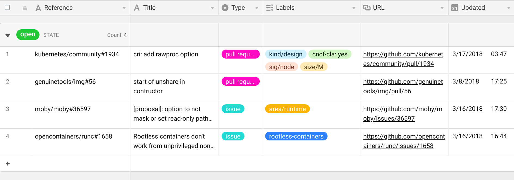

# gitable

[](https://github.com/jessfraz/gitable/actions?query=workflow%3A%22make+all%22)
[](https://github.com/jessfraz/gitable/actions?query=workflow%3A%22make+image%22)
[](https://godoc.org/github.com/jessfraz/gitable)

Bot to automatically sync and update an [Airtable](https://airtable.com) sheet with 
GitHub pull request and issue data.

<!-- START doctoc generated TOC please keep comment here to allow auto update -->
<!-- DON'T EDIT THIS SECTION, INSTEAD RE-RUN doctoc TO UPDATE -->
**Table of Contents**

- [gitable](#gitable)
  - [Installation](#installation)
      - [Binaries](#binaries)
      - [Via Go](#via-go)
      - [Running with Docker](#running-with-docker)
  - [Usage](#usage)
  - [Airtable Setup](#airtable-setup)
      - [Using the API](#using-the-api)
      - [Format](#format)

<!-- END doctoc generated TOC please keep comment here to allow auto update -->


## Installation


#### Binaries

For installation instructions from binaries please visit the [Releases Page](https://github.com/jessfraz/gitable/releases).

#### Via Go

```console
$ go get github.com/jessfraz/gitable
```

#### Running with Docker

```console
$ docker run --restart always -d \
    -v /etc/localtime:/etc/localtime:ro \
    --name gitable \
    -e "GITHUB_TOKEN=59f6asdfasdfasdf0" \
    -e "AIRTABLE_APIKEY=ksdfsdf7" \
    -e "AIRTABLE_BASEID=appzxcvewrwtrewt4" \
    -e "AIRTABLE_TABLE=Current Open GitHub Pull Request and Issues" \
    r.j3ss.co/gitable --interval 1m
```

## Usage

```console
$ gitable -h
gitable -  Bot to automatically sync and update an airtable sheet with GitHub pull request and issue data.

Usage: gitable <command>

Flags:

  --airtable-apikey  Airtable API Key (or env var AIRTABLE_APIKEY) (default: <none>)
  --airtable-baseid  Airtable Base ID (or env var AIRTABLE_BASEID) (default: <none>)
  --airtable-table   Airtable Table (or env var AIRTABLE_TABLE) (default: <none>)
  --autofill         autofill all pull requests and issues for a user [or orgs] to a table (defaults to current user unless --orgs is set) (default: false)
  -d, --debug        enable debug logging (default: false)
  --github-token     GitHub API token (or env var GITHUB_TOKEN)
  --interval         update interval (ex. 5ms, 10s, 1m, 3h) (default: 1m0s)
  --once             run once and exit, do not run as a daemon (default: false)
  --orgs             organizations to include (this option only applies to --autofill) (default: [])
  --watch-since      defines the starting point of the issues been watched (format: 2006-01-02T15:04:05Z). defaults to no filter (default: 2008-01-01T00:00:00Z)
  --watched          include the watched repositories (default: false)

Commands:

  version  Show the version information.
```

## Airtable Setup 

#### Using the API

[Follow this guide](https://help.grow.com/hc/en-us/articles/360015095834-Airtable).

#### Format

Your airtable table must have the following fields: 

- `reference` **(single line text)**
- `title` **(single line text)** 
- `type` **(single select)**
- `state` **(single line text)**
- `author` **(single line text)**
- `labels` **(multiple select)**
- `comments` **(number)**
- `url` **(url)**
- `updated` **(date, include time)**
- `created` **(date, include  time)**
- `completed` **(date, include time)**
- `project` **(link to another sheet)**
- `repository` **(single line text)**

The only data you need to initialize **(if not running with `--autofill`)** 
is the `Reference` which is in the format
`{owner}/{repo}#{number}`.

It should look like the following:


